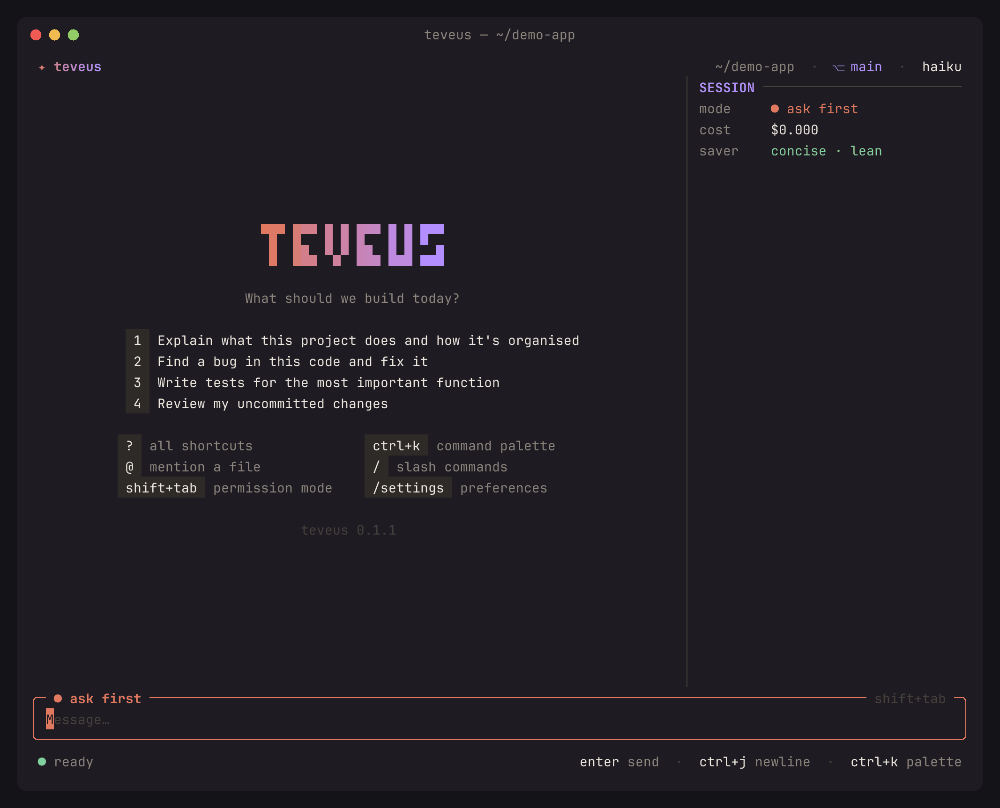
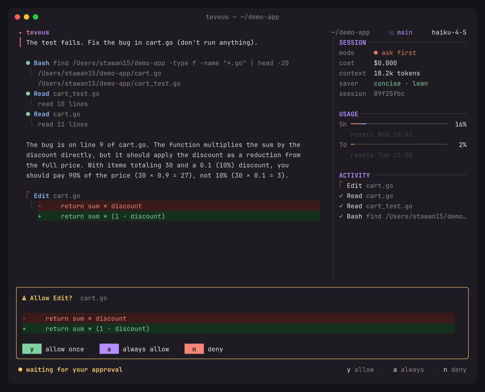
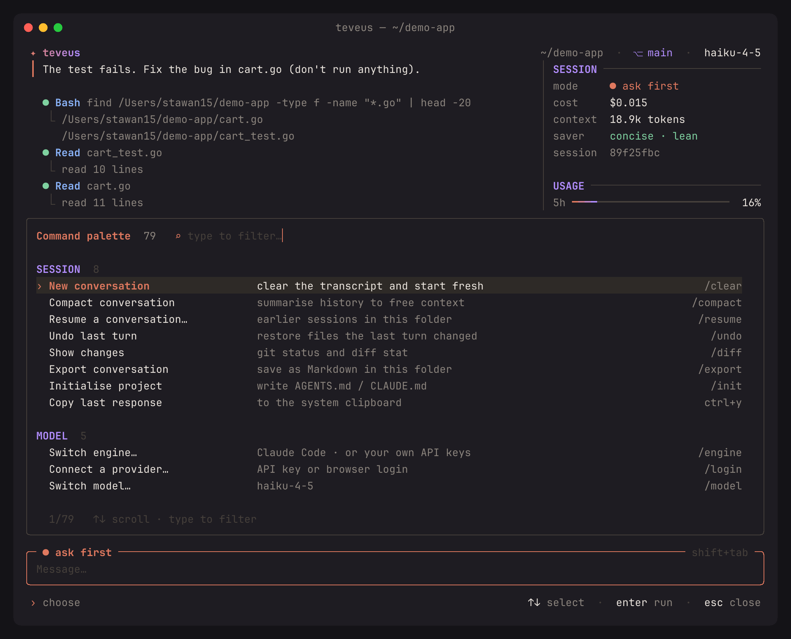
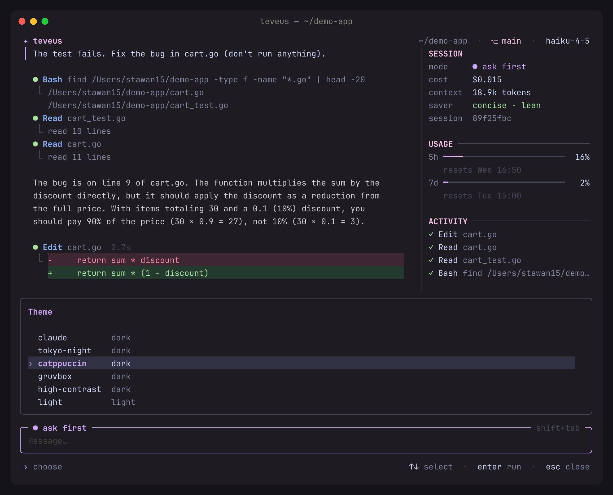

<div align="center">

# teveus

**A friendly terminal for AI coding.**
Run Claude Code, or any AI provider with your own key, in one fast, good-looking app.



</div>

## Install

```sh
curl -fsSL https://raw.githubusercontent.com/stawan15/teveus/main/install.sh | sh
```

Works on macOS and Linux. Run the same line again to update.

> **Want Claude models on your Claude plan?** Install [Claude Code](https://claude.com/claude-code) from Anthropic and sign in to it.
> teveus runs your installed Claude Code as it is. You sign in through Anthropic's own login, and teveus never sees your Claude credentials.
> For OpenAI, Gemini, OpenRouter and others you don't need anything else.

## Get started

1. Open a terminal in your project folder.
2. Run `teveus`.
3. Type what you want in plain words, like *"find the bug in the login page and fix it"*, and press **enter**.

teveus shows you every change **before** it happens. Press **y** to allow it or **n** to say no.

The first time, a short setup (3 questions) helps you pick how much guidance you want, a colour theme, and how to connect.

## What it looks like

| Approve changes before they happen | Every action one search away |
|:---:|:---:|
|  |  |
| **Welcome screen with starter ideas** | **Themes preview live** |
|  |  |

## What you can do

| | |
|---|---|
| 💬 **Ask in plain words** | Explain code, fix bugs, write tests, review changes |
| ✅ **Stay in control** | See each change as a coloured diff and approve it first |
| 🔌 **Use any AI** | Claude Code (with your own Claude account), OpenAI, the Anthropic API, Gemini, OpenRouter (hundreds of models, many free), Groq, DeepSeek, xAI, Mistral, or local models (Ollama, LM Studio) |
| 🖼️ **Show, don't describe** | Drop a screenshot on the terminal or press `ctrl+v`; long pastes fold into `[Pasted text #1 +40 lines]` |
| 🌐 **Web, MCP and helpers** | On the Direct API engine: reads web pages, searches the web (Brave or Tavily key), uses MCP servers from `.mcp.json`, and sends research to parallel sub-agents. Claude Code brings its own. |
| 🔒 **Rules you set once** | On the Direct API engine: "always allow `go test`" is saved per project, and `/permissions` lists, adds and removes allow/deny rules |
| ↩️ **Undo** | `/undo` puts files back the way they were |
| 🕘 **Pick up later** | `/resume` reopens earlier conversations |
| 💸 **Spend less, when you want** | Off until you turn them on: `/concise` for short answers, `/lean` to send fewer tool definitions, and `/minimal` (a slider from off to strict) so the model reuses what exists and writes only what the task needs |
| ✂️ **Trim the fat** | `/trim` reviews your uncommitted changes for code you don't need; `/trim all` checks the whole project |
| 🎨 **Make it yours** | 6 themes (including high contrast), 3 guidance levels, reduce motion |

## Keys to know

You only need the first three. Press **`?`** inside teveus to see the rest.

| Key | Does |
|---|---|
| `enter` | Send your message |
| `shift+enter` | New line (or `ctrl+j`, or `\` then `enter`) |
| `ctrl+k` | Find any action (command palette) |
| `?` | Show all shortcuts |
| `shift+tab` | Switch mode: **ask first** → **auto-edit** → **plan only** → **autopilot** |
| `@` | Attach a file by name |
| `ctrl+v` | Paste an image from the clipboard |
| `esc` `esc` | Stop the current task |
| drag with the mouse | Select text (it's copied when you let go) |
| `ctrl+c` `ctrl+c` | Quit |

## Commands

Type `/` to see them all. The most useful:

| Command | Does |
|---|---|
| `/login` | Sign in to Claude Code, or connect another AI provider |
| `/model` | Switch model (search by name, or type `free`) |
| `/effort` | How hard the model thinks: a slider from auto and low up to max |
| `/undo` | Undo the last change |
| `/resume` | Reopen an earlier conversation |
| `/diff` | See what changed |
| `/init` | Let the AI write notes about your project so it works better |
| `/settings` | All preferences in one place |
| `/mcp` | See MCP servers, and approve a project's `.mcp.json` |
| `/permissions` | Saved allow/deny rules for tools |
| `!command` | Run a shell command, e.g. `!npm test` |

## Connect other AI providers

Run `/login` inside teveus and pick one:

- **OpenRouter**: log in with your browser, no key to copy. Hundreds of models; type `free` in `/model` to find free ones.
- **OpenAI, Anthropic, Gemini, Groq, DeepSeek, xAI, Mistral**: paste an API key. It's checked before saving and stored only on your computer.
- **Ollama or LM Studio**: runs on your own machine; nothing to set up if it's running.

## Use it from scripts

`teveus -p "your prompt"` runs one prompt without the UI and prints the reply; add `-json` for the cost and token counts.
Tools that need approval are refused unless you pass `-mode acceptEdits` or `-mode auto`.

## Questions

<details>
<summary><b>Do I use my Claude plan, or pay per token?</b></summary>

With the **Claude Code** engine (the default), teveus runs your installed Claude Code, and Claude Code uses whatever you signed in to it with: your Claude plan or an API key.
teveus only starts the `claude` program and shows what it does. It never reads, stores or sends your Claude login.
With **Direct API** (`/engine`), you pay the provider per token with your own key.
</details>

<details>
<summary><b>Is teveus made by Anthropic?</b></summary>

No. teveus is an independent open-source project. It isn't affiliated with, endorsed by, or supported by Anthropic.
</details>

<details>
<summary><b>How do I select and copy text?</b></summary>

Drag with the mouse; the text is copied when you let go. Double-click selects a word and triple-click a line.
`ctrl+y` copies the whole last reply. Prefer your terminal's own selection? Run `/mouse`.
</details>

<details>
<summary><b>Where are my settings and keys?</b></summary>

In `~/.config/teveus/`. Keys are in `auth.json`, readable only by you.
</details>

<details>
<summary><b>How do I uninstall?</b></summary>

```sh
rm ~/.local/bin/teveus
rm -rf ~/.config/teveus   # also removes settings and saved keys
```
</details>

## More ways to install

- **Go:** `go install github.com/stawan15/teveus@latest`
- **Windows or manual download:** grab an archive from [Releases](https://github.com/stawan15/teveus/releases)
- **Installer options:** `TEVEUS_INSTALL_DIR=/usr/local/bin` or `TEVEUS_VERSION=v0.1.1` before `sh`

## Development

```sh
go build -o teveus . && ./teveus   # run from source
go test ./...                       # tests
docs/record.sh                      # re-record the demo GIF from a real session
```

Built with [Bubble Tea](https://github.com/charmbracelet/bubbletea), [Lip Gloss](https://github.com/charmbracelet/lipgloss) and [Glamour](https://github.com/charmbracelet/glamour).
[CLAUDE.md](CLAUDE.md) explains how the code is organised.

## Privacy and security

teveus has no telemetry and no servers: what you send goes only to the AI provider you picked. [PRIVACY.md](PRIVACY.md) lists exactly what is sent where and what is stored on your computer; [SECURITY.md](SECURITY.md) explains the safeguards and how to report a vulnerability privately.

## Legal

- teveus is an independent project, not affiliated with, endorsed by, or sponsored by Anthropic PBC or any other AI provider.
  Claude, Claude Code and Anthropic are trademarks of Anthropic PBC; other names belong to their owners and are used only to say what teveus works with.
- Your use of Claude Code and Claude is governed by Anthropic's [Consumer Terms](https://www.anthropic.com/legal/consumer-terms) or [Commercial Terms](https://www.anthropic.com/legal/commercial-terms) and [Usage Policy](https://www.anthropic.com/legal/aup), and other providers' services by their own terms.
  teveus doesn't resell, pay for, or route anyone's AI usage; each person uses their own account or key.
- AI agents can edit and delete files and run commands. Review what you approve and keep your work in version control.
  teveus is provided "as is", without warranty of any kind, and the authors aren't liable for any damage, loss or cost from using it; see the [license](LICENSE).

## License

[MIT](LICENSE)
